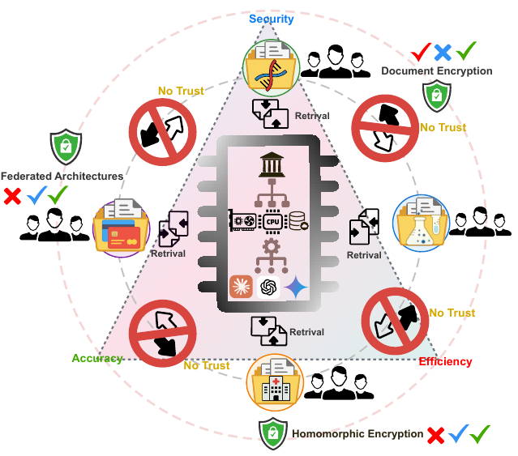

# Trans-RAG

[](https://link.springer.com/chapter/10.1007/978-981-92-0372-7_35)
[](https://www.python.org/)

> **A drop-in security layer compatible with any RAG pipeline** — works across any retriever, embedding model, vector database, and LLM.

**[2026-01-27]** 🎉 Our paper has been accepted as a **DASFAA 2026 regular paper**.

**Trans-RAG** is a query-centric vector transformation framework for secure cross-organizational retrieval. The focus is the vector-space transformation method itself: users bring their own embedding model, vector database, retriever, and LLM.

Trans-RAG creates **organization-specific private vector spaces**. Each organization owns a transformation key, document vectors are transformed before indexing, and user queries are transformed into each authorized organization's vector space at retrieval time. This clean release does not ship datasets, indexes, retrievers, LLMs, or secure baselines; it exposes the core transformation layer and works with external vector stores such as FAISS, Milvus, pgvector, or in-house indexes.

<p align="center">
  
  <br>
  <em>Figure 1 — Cross-organizational retrieval without mutual trust faces the security-accuracy-efficiency trade-off.</em>
</p>

## 🔐 vector2Trans

Each transformation stage applies:

1. Key-derived permutation
2. Input-dependent zero-mean blinding
3. Bounded non-linearity $f_{\beta}(x) = \tanh(\beta x)/\beta$
4. Key-derived orthogonal rotation with offsets
5. Post-transformation blinding
6. Inverse permutation

**Mathematical formulation.** Given a 256-bit organization key $K$ and an input vector $v$ of dimension $d$, the full $n$-stage transformation composes:

$$\mathcal{T}_i(v;\mathcal{K}_i) = \mathcal{T}_i^{(n)} \circ \mathcal{T}_i^{(n-1)} \circ \cdots \circ \mathcal{T}_i^{(1)}(v)$$

Each stage chains a key-derived permutation $P$, cryptographic blinding $B$, bounded non-linearity $f_{\beta}$, orthogonal rotation $W$, and offsets $b$, $c$:

$$\mathcal{T}_i^{(j)}(v) = \mathcal{P}_i^{(j)-1}\!\Bigl( \mathcal{B}_i^{(j+n)}\bigl( W_i^{(j)} \cdot f_{\beta}\bigl( \mathcal{B}_i^{(j)}(\mathcal{P}_i^{(j)}(v)) + b_i^{(j)} \bigr) + c_i^{(j)} \bigr) \Bigr)$$

followed by $\ell_2$-normalization, with $f_{\beta}(x) = \tanh(\beta x)/\beta$ and $W^{\top}W = I$. Every per-stage parameter $(\pi, W, b, c, \beta, \delta)$ is derived deterministically from $K$ via SHA-256.

**Decoupled from LLM, corpus, and consortium.** The transformation operates purely on dense vectors, leaving the downstream language model and vector-store backend untouched. Per-query overhead is invariant to corpus size; its dominant cost comes from the orthogonal multiplications and grows as $O(nd^2)$ in the number of stages $n$ and the embedding dimensionality $d$. The cross-space isolation guarantee scales as $O(d^{-1/2})$ in $d$ and remains independent of the number of organizations $m$ under the key-independence assumption.

<p align="center">
  
  <br>
  <em>Figure 2 — Trans-RAG architecture (top) and vector2Trans pipeline (bottom).</em>
</p>

## 📂 Layout

```text
transrag/
├── assets/
│   ├── motivation.pdf / motivation.png
│   └── overview.png
├── src/
│   ├── vector2trans.py    # vector2Trans / TransRAG transformation
│   ├── keys.py            # Key generation, validation, JSON I/O, transform helpers
│   ├── keyring.py         # Multi-organization key registry
│   ├── core.py            # Authorized query workflow and result aggregation
│   └── diagnostics.py     # Isolation / cosine / angular / k-NN diagnostics
├── environment.yml        # Conda env
└── pyproject.toml         # Package metadata
```

## 🛠 Environment

```bash
conda env create -f environment.yml
conda activate transrag
pip install -e .
```

## 🚀 Usage

### Transform vectors

**Principle.** Each organization owns a private "language" of vector space defined by its key. Document embeddings are translated into that organization's language once before being stored in its private index. A query embedding is dynamically translated into the languages of every authorized organization, so the same query can simultaneously "speak" to every organization's private space without exposing the original embedding.

```python
import numpy as np
from transrag import generate_org_key, transform_query_for_orgs, transform_vectors

dim = 768  # set to your retriever's output dimension (e.g. 768 for MPNet/BGE, 1024 for Ember/UAE/GTE, 4096 for Linq, 8192 for Stella)

org_a_key = generate_org_key("org_a", dim=dim, stages=4)
org_b_key = generate_org_key("org_b", dim=dim, stages=4)

# Transform document embeddings before storing them in your own vector DB.
doc_vectors = np.random.randn(1000, dim).astype("float32")
org_a_private_vectors = transform_vectors(doc_vectors, org_a_key)

# Transform one query embedding for each authorized organization.
query_vector = np.random.randn(dim).astype("float32")
queries_by_org = transform_query_for_orgs(
    query_vector,
    {"org_a": org_a_key, "org_b": org_b_key},
)
```

### Multi-organization retrieval

**Principle.** A `KeyRing` holds one key per organization — the registry of "languages" the application is allowed to speak. At query time the query embedding is translated into every authorized organization's language, dispatched to that organization's private index, and the top hits from each space are aggregated into a single cross-organizational ranking. Organizations without a key see only random-looking queries, so unauthorized retrieval degrades to noise.

```python
import numpy as np
from transrag import KeyRing, TransRAGCore

dim = 768  # set to your retriever's output dimension (e.g. 768 for MPNet/BGE, 1024 for Ember/UAE/GTE, 4096 for Linq, 8192 for Stella)
keyring = KeyRing.generate(["org_a", "org_b"], dim=dim, stages=4)
transrag = TransRAGCore(keyring)

# Store these transformed vectors in your own FAISS / Milvus / pgvector / in-house index.
doc_vectors = np.random.randn(1000, dim).astype("float32")
private_doc_vectors = transrag.transform_documents("org_a", doc_vectors)

def search_my_vector_db(org_id, transformed_query, top_k):
    # Replace this callback with your own vector database search.
    return [
        {"item_id": f"{org_id}:doc-1", "score": 0.91, "text": "retrieved context"}
    ][:top_k]

query_vector = np.random.randn(dim).astype("float32")
results = transrag.search(
    query_vector,
    search_my_vector_db,
    authorized_org_ids=["org_a", "org_b"],
    per_org_top_k=10,
    final_top_k=5,
)
```

## 📚 Citation

If this work helps your research, please cite:

```bibtex
@inproceedings{liu2026transrag,
  title     = {Trans-RAG: Query-Centric Vector Transformation for Secure Cross-Organizational Retrieval},
  author    = {Liu, Yu and Peng, Kun and Zhang, Wenxiao and Yuan, Fangfang and Cao, Cong and Lu, Wenxuan and Liu, Yanbing},
  booktitle = {Database Systems for Advanced Applications},
  publisher = {Springer},
  year      = {2026},
  doi       = {10.1007/978-981-92-0372-7_35}
}
```
